# Decentralized Chat Application
Alan Wilms & Yunhua Zhao

CS3281: Reslilient Distributed Systems Fall 2018

## Overview
We have created a decentralized chat application using Python and a number of libraries. The chat application features RSA-AES encryption, custom user and roomnames, both multi-user group chats and two person chats, a room joining permission system, and a full stored chat history. This application is backed by strong resiliency by leveraging ETCD, which is a popular distributed key-value store that uses the Raft consensus algorithm.

The project is separated into two major parts:
1. Client (`basic_client.py`)
  This takes care of input/output and text-based user interface via the curses library. This script controls the flow from the moment of login, to the room selection decision, and finally the actual chatting within a room. Error message are presented to the user as appropriate.
2. Custom Etcd Library (`etcd_chat_lib.py`)
  This backend library interfaces with the Etcd instance running on the local machine and provides client specific wrapper functions that are called by the client. Since Etcd is, by definition, a key-value store, these functions perform most of the work in transforming our schema (see below) from strings of simply "/" separated values.

## Installation Instructions
Run the following scripts (found in the setup-scripts folder). Note that you will update the IP Addresses for config_and_run_etcd.sh and the basic_client.py to ones that you will have access to. These are public IP addresses and **must be on the same network**. Lastly, sudo permissions might be necessary.
1. clone the repo and `cd group-project-NOP/setup-scripts`
1. `./install_go_and_etcd.sh`
2. `./config_and_run_etcd.sh 0`, substituting the 0 with whatever machine number you're using
3. `apt-get install python`
4. `apt-get install python-pip`
5. `pip install etcd`
6. `pip install rsa`
7. `pip install cryptography`
8. `python ../src/basic_client.py`

## In Action
[Video](https://drive.google.com/file/d/1pOO16q6Cb83CLkxmITpp63cBf-t5G9Bi/view?usp=sharing)
Note: the IP flag to run the script has been removed in favor of multiple, hard-coded IP addresses for added resiliency

The user is greeted by a login screen and is prompted to enter his or her username. Since this decentralized chat application is a proof of concept, a more formal login could be added in the future.
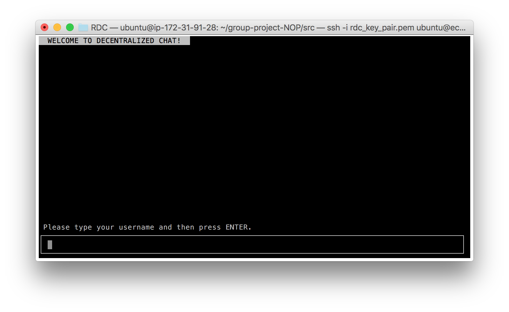

The user is then shown a list of every room available and will select one by index. Note that the message changes slightly for only a single chat room (grammar) or no chat rooms (mandating the create a room option)
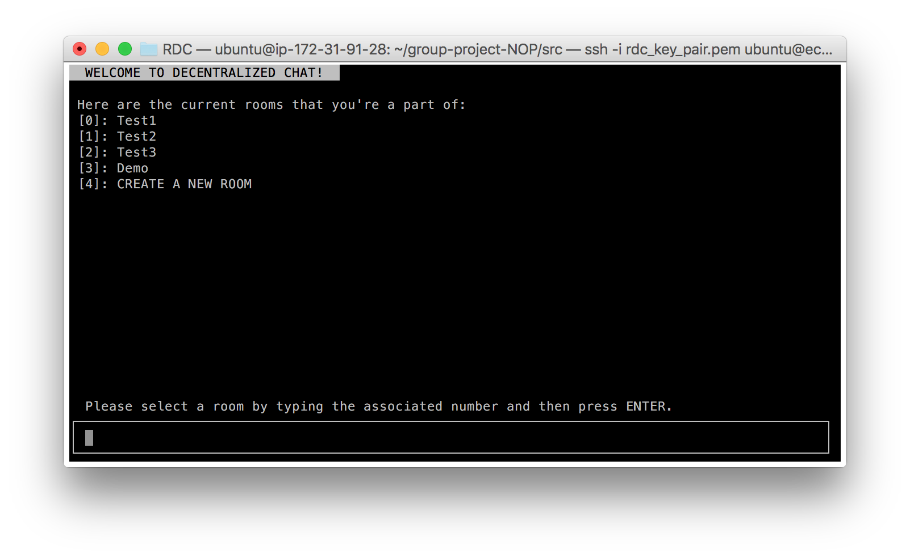

If the user is not a member of the group chat, then approval is required from members of the group chat.  From the user's perspective, the application is halted until approval is received and is clearly notified with a message.
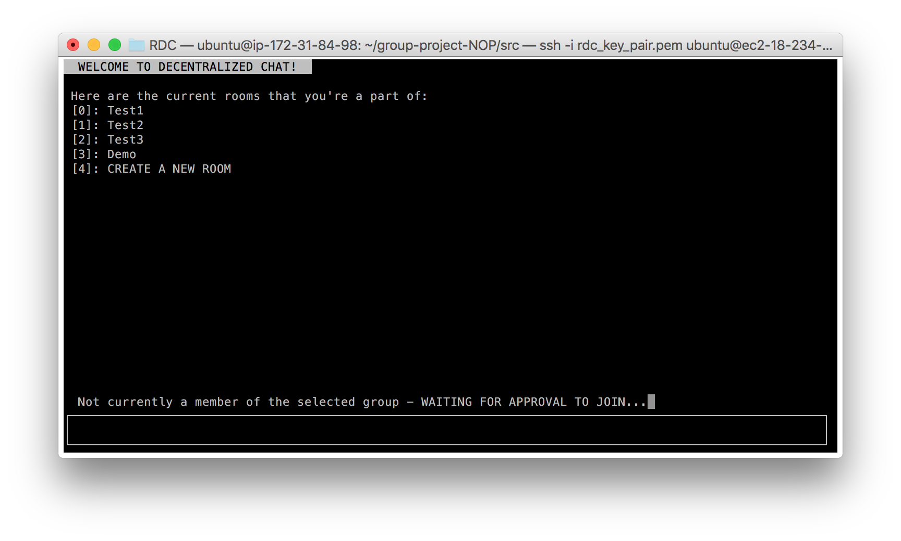

Members of the chat room in question will receive an admin message declaring the username of the user that attepts to join and can approve this use with a simple command "!<username>".
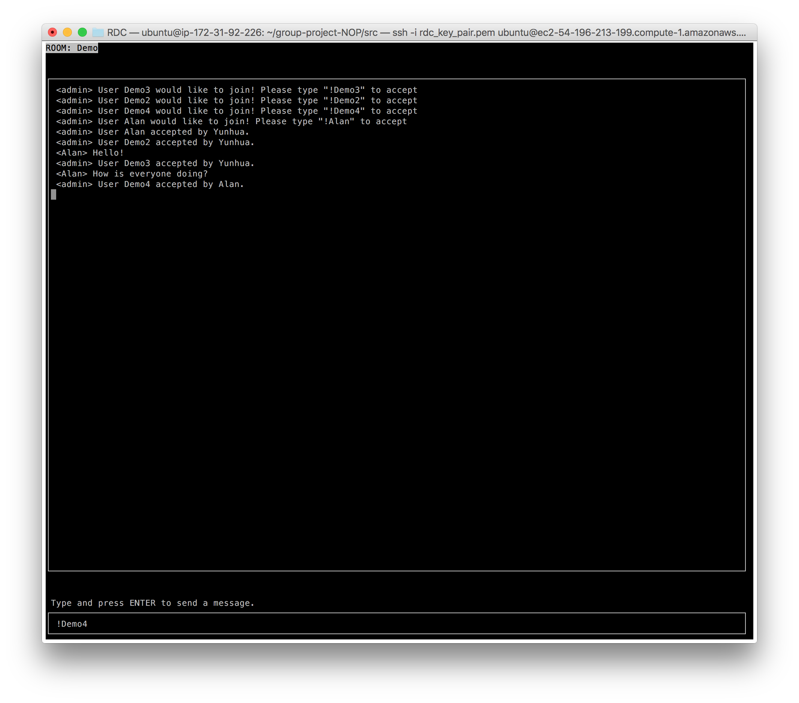

All previous chats are populated in the new user's window. From now on, this user can join this group without approval and can send messages freely.
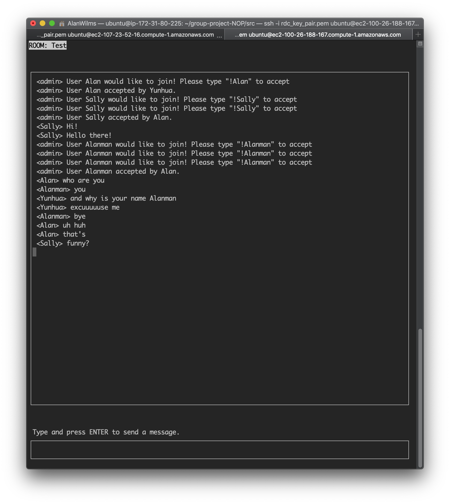

## Message Storage Schema

Using etcd as a key-value storage we have devised the following '/'-delimited storage schema:

#### Primary message storage:
The separation of these items were necessary due to the introduction of encryption. 

```
Key: chats/[chatroom_name]/[message_id]

Value: [encrypted_message]
```

```
Key: chats/[chatroom_name]/[message_id]/encrypted_aes_key

Value: [encrypted_aes_key]
```

```
Key: chats/[chatroom_name]/[message_id]/author

Value: [user_id]
```

#### Metadata storage:
These were necessary to list all available chatrooms, as an easy checking for new messages and users during polling, and to handle private and public key encryption.

```
Key: meta/chatrooms

Value: [chatroom_name]/[chatroom_name]/.../[chatroom_name]
```

```
Key: meta/[chatroom_name]/num_messages

Value: [num_messages]
```

```
Key: meta/[chatroom_name]/public_key

Value: [n_value]/[e_value]
```

```
Key: meta/[chatroom_name]/members

Value: [user_id]/[user_id]/.../[user_id]
```

```
Key: meta/[chatroom_name]/num_members

Value: [num_members]
```

```
Key: meta/[chatroom_name]/[user_id]/public_key

Value: [n_value]/[e_value]
```

```
Key: meta/[chatroom_name]/[user_id]/encrypted_private_key

Value: [encrypted_rsa_private_key]
```


```
Key: meta/[chatroom_name]/[user_id]/encrypted_aes_key

Value: [encrypted_aes_key]
```

## Encryption

We use a combination of RSA and AES encryption to control the data that each client has access to. Since the local instances of etcd all store all of the chat data, it is imperative that a secure encryption protocol allows only the members of each group chat to decrypt and read their messages.

When a user creates a new group chat, a new set of RSA keys are generated. The private key is stored in the user's `private_keys` directory as `chatroom_name.pem`, and the public key is stored in the database according to the schema above. Messages sent by the client are encrypted using the public key, and stored in the database. Members of the group can then decrypt the incoming messages and display them client-side.

Unfortunately, a 512-bit RSA encryption scheme can only encrypt up to 53 bytes at a time. So we use AES, a symmetric encrpytion scheme (using the same key for encryption and decryption), to generate a different random key for each message to encrypt it block-wise. Then, the AES key is encrypted using the RSA public key, and both the encrypted AES key and the encrypted message are stored in the database in hexadecimal format, to ensure that no weird characters from Unicode encoding are incompatible with etcd storage. The two-step encryption process is wrapped up as single encrypt and decrypt methods in the backend, and is used whenever any encryption needed in the application.

The next challenge came with securely distributing private keys to new members. The new member requests to join an existing group, and must wait for approval from an existing member. While before requesting approval, the new member client creates its own set of RSA public and private keys, and makes its public key available in the database for receiving the group private key.


Within the chat, the client automatically posts a message indicating that a new member wants to join, and allows existing members to approve it via a command `!requester_username`.

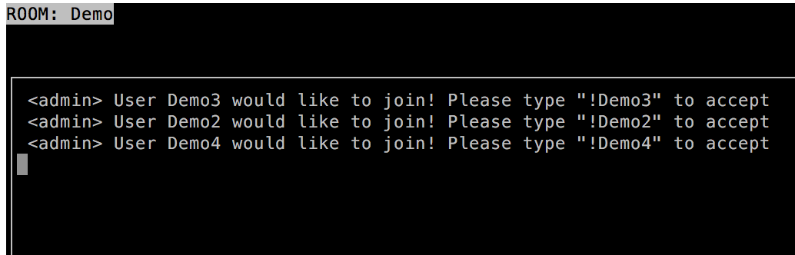

Once someone in the group approves, that member will encrypt his copy of the group private key with the requester's individual public key (along with a randomly generated AES key as before), and put it in the database for the requester to retrieve and decrypt with his individual private key. The requester has now securely received a copy of the group private key, and can join the group chat and access all previous messages.


## Reliability Analysis

### Cluster Setup

For our demo setup, we created a cluster of 5 machines. We configured the cluster initially to be of size 4, via the [configuration script](../setup_scripts/config_and_run_etcd.sh).

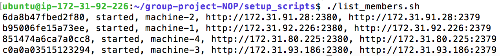

Then, as a proof of concept, we added a fifth machine by reconfiguring the cluster after initialization.

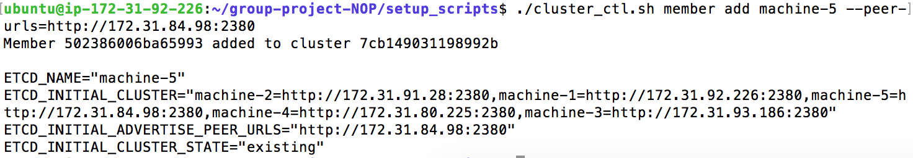

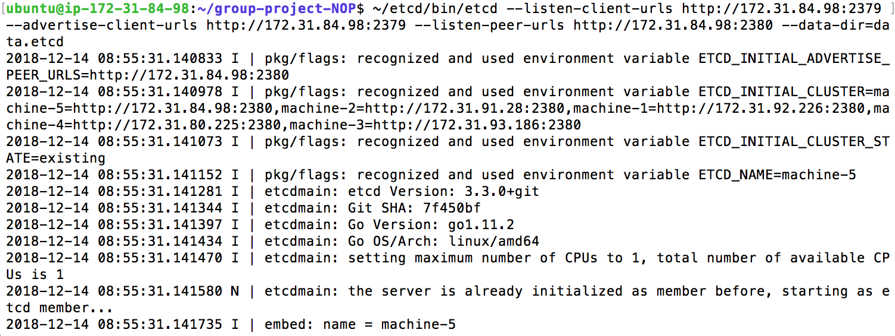

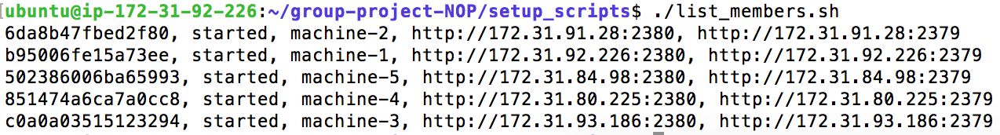

### Database Failure During Application Usage

To demonstrate the decentralized nature of our data storage, we manually crashed one instance of etcd while running the chat client on the 5 different machines. The client remains connected and able to access all messages, even if it is relaunched.

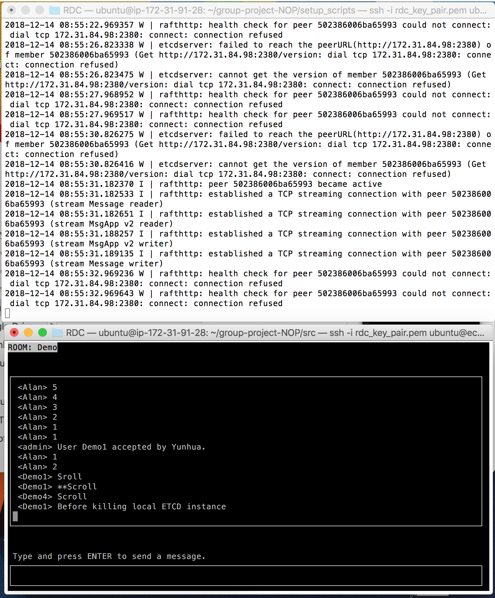

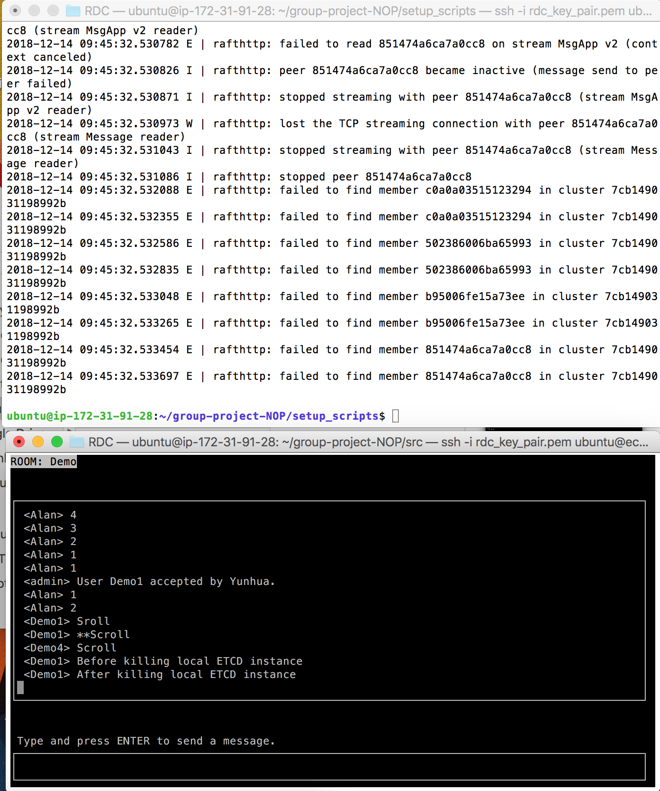

Since our cluster has 5 nodes, it can tolerate the failure of 2 nodes via the RAFT algorithm, so we manually crashed another instance of etcd. Again, the chat client running on that machine was still able to function normally.

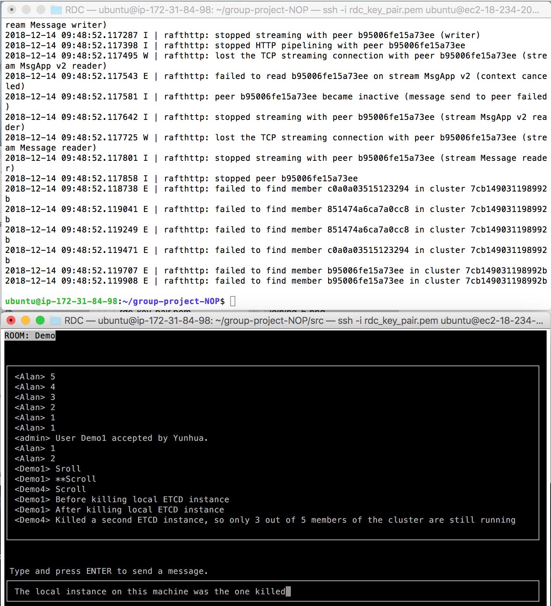

The extensibility of our scripts allows for multiple nodes to be added to our cluster. For extra reliability, additional nodes can be added, to increase the failure tolerance of the system.
